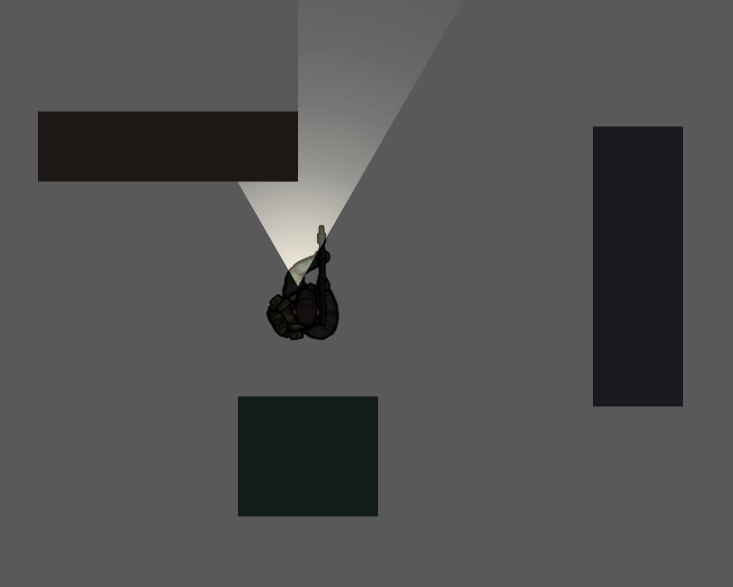

# Prep Engine

Prep Engine is a lightweight, top-down 2D game engine written in plain JavaScript. It provides a small core for scene management, a simple physics system (AABB and circle support), a central renderer, and utilities to build interactive examples quickly.

This repository is intentionally minimal and focused on being a clean, easy-to-read starting point for prototyping and learning engine systems.

Contributing
- Keep the code simple and readable. This project prefers clarity over micro-optimizations.
- Add tests or examples to [`examples/`](examples/) when you add new APIs.

# Status
The engine is currently in early development.

# License
Prep is licensed under the MIT License. See [LICENSE](LICENSE) for more information.